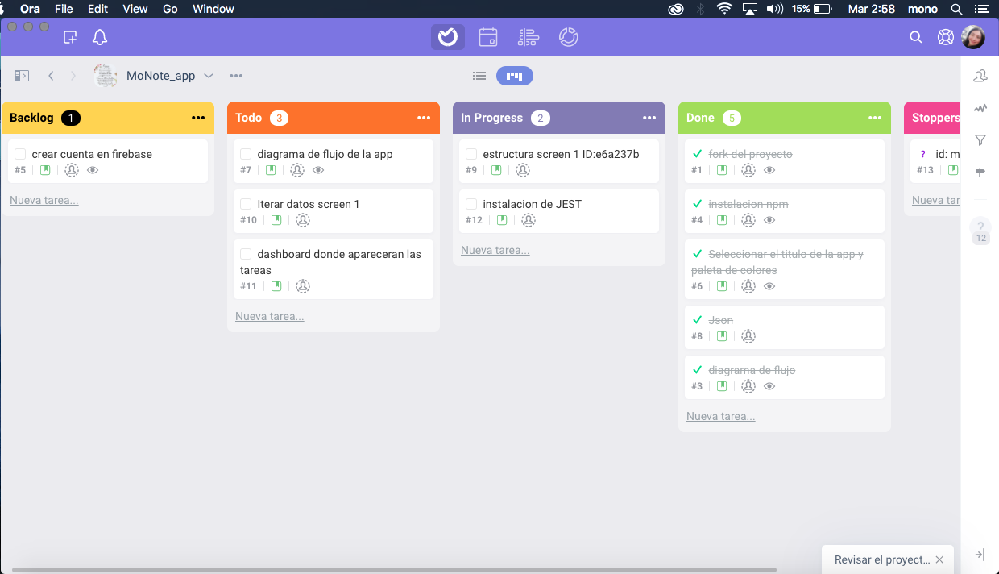
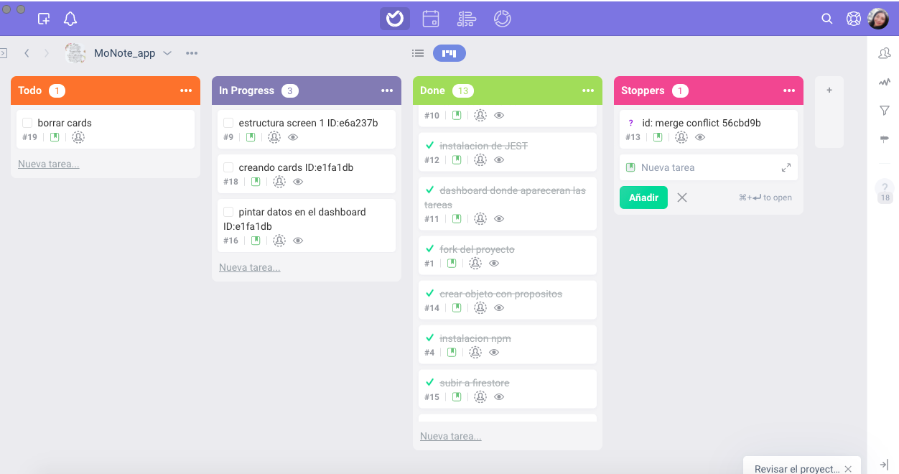
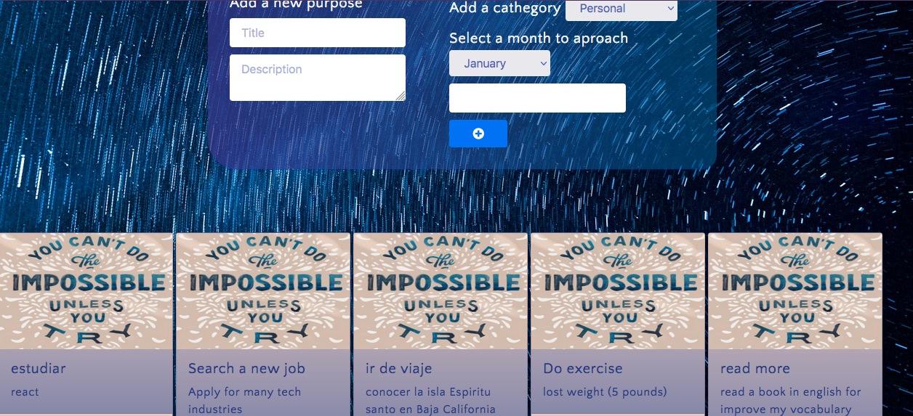
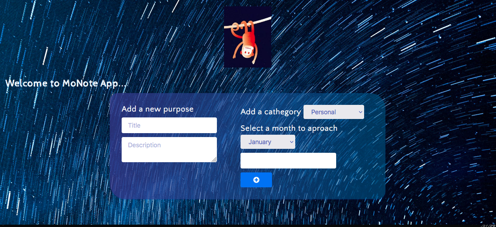

# Technical Challenge

---

Index

    1. Description
    2. Aceptance Criteria
    3. Technical Requirements
    4. Expected Learning Outcomes

---

## 1. Descripción

MoNote es una app que permite al usuario ingresar sus metas o planes mediante un formulario, estas metas se imprimen en tarjetas que puede ver y recordar facilmente.
Cuenta con 5 categorias: Salud, Familia, Aprendizaje,Personal,Familiar y Relaciones.

---

## 2. Criterios de Aceptación

Esta aplicación debería permitirle ingresar sus metas y objetivos con los campos:

- Temas desplegables seleccionables: personal, profesional, relaciones, familia, salud y aprendizaje
- Título: entrada para agregar un título corto
- Descripción: Área de texto para agregar la descripción de la meta
- Desplegable con el mes objetivo de consecución.

---

## 3. Requerimientos técnicos

Resultados de traducción
Siga todos los pasos de Lyfecycle de desarrollo de software y documéntelo

- Solo se permite JavaScript Vanilla
- Usa todas las cosas que ya sabes y que has aprendido del Bootcamp para resolver el código de la aplicación.
- Use Firestore de Firebase para conservar sus datos
- Solo se permiten funciones de flecha (ECS6)
- Usar arquitectura modular modular es una ventaja
- Agregar un inicio de sesión personal para usted es una ventaja
- Terminar antes de tiempo es un plus
- ***

## 4. Aprendizaje esperado

---

- [ ] window object
- [ ] Arrow Functions and parameters
- [ ] Short, readable and reusable code
- [ ] Objects & Arrays
- [ ] JSON
- [ ] Iterators
- [ ] Firebase: Firestore DB
- [ ] Bootstrap 5
- [ ] Continuous Integration Tools: Git & GitHub

---

## Proceso de flujo de trabajo

Se utiliza el método agile para distribuir las tareas del proyecto

---

## 3. UI(user interface)

### Maquetación

---

## Diagrama de flujo

